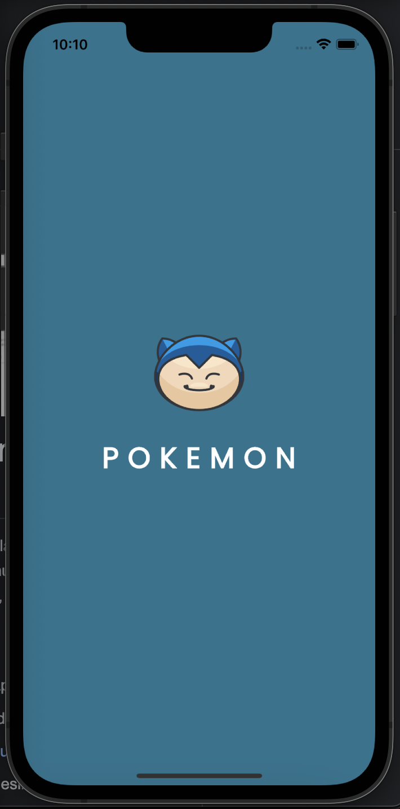
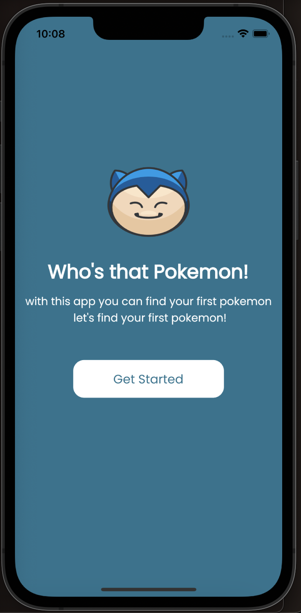
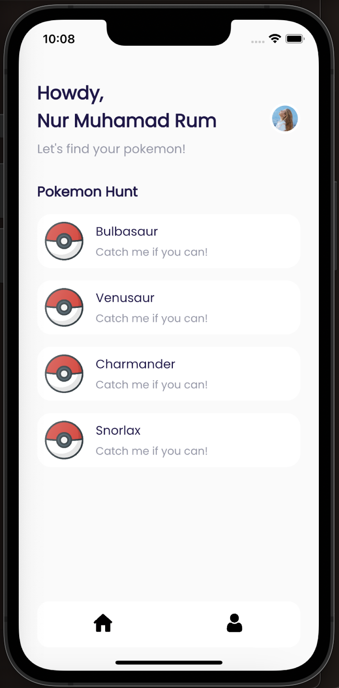
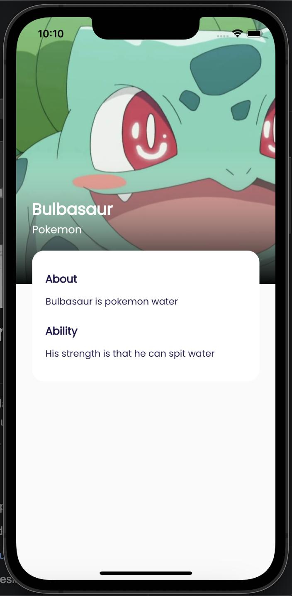
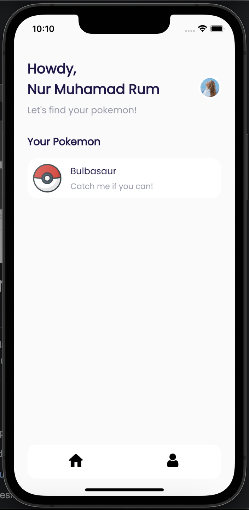

# Flutter Developer Test | Global Urban Esensial

## Table of Contents

- [Getting Started](#getting-started)
  - [Prerequisites](#prerequisites)
  - [Installation](#installation)
- [Screenshots](#screenshots)
- [Built With](#built-with)
- [Author](#author)

## Getting Started

Before starting to install the project, there're some things that need to be done first.

### Prerequisites

Make sure all of these are properly installed in your system.

| Application  | Download                                                                            |
| ------------ | ----------------------------------------------------------------------------------- |
| Git          | [Windows](https://gitforwindows.org/) / [Linux](https://git-scm.com/download/linux) / [MacOS](https://git-scm.com/download/mac) |
| Flutter | [Link](https://docs.flutter.dev/get-started/install)                |

## Installation
### How to Installation & Running App Application Localy

First, clone this repository into your system.

```
git clone https://github.com/nurmuhamadrum/flutter-pokemon.git
```

## Screenshots

<div style={{ display: 'flex' }}>
    
    
    
    
    
</div>

## Built With

- [FLUTTER](https://docs.flutter.dev/) - FLUTTER
- [API](https://pokeapi.co/) - MOCK API

## Author

**Nur Muhamad Rum** - www.nurmuhamadrum.site
